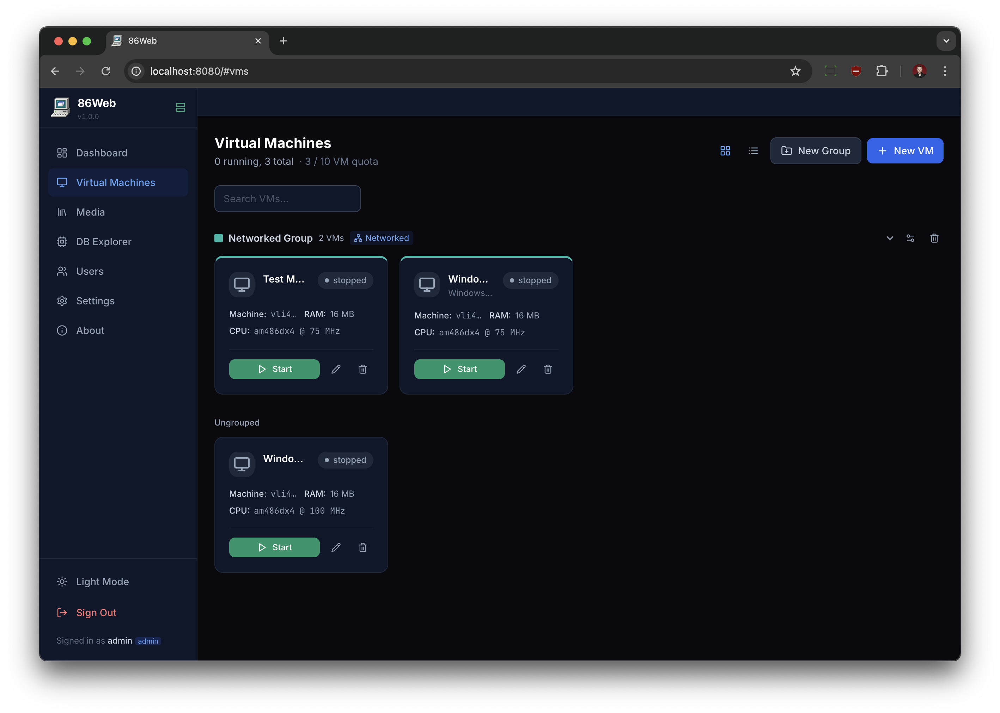
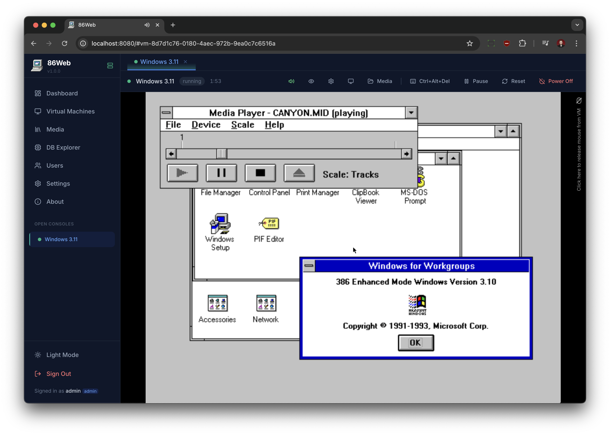
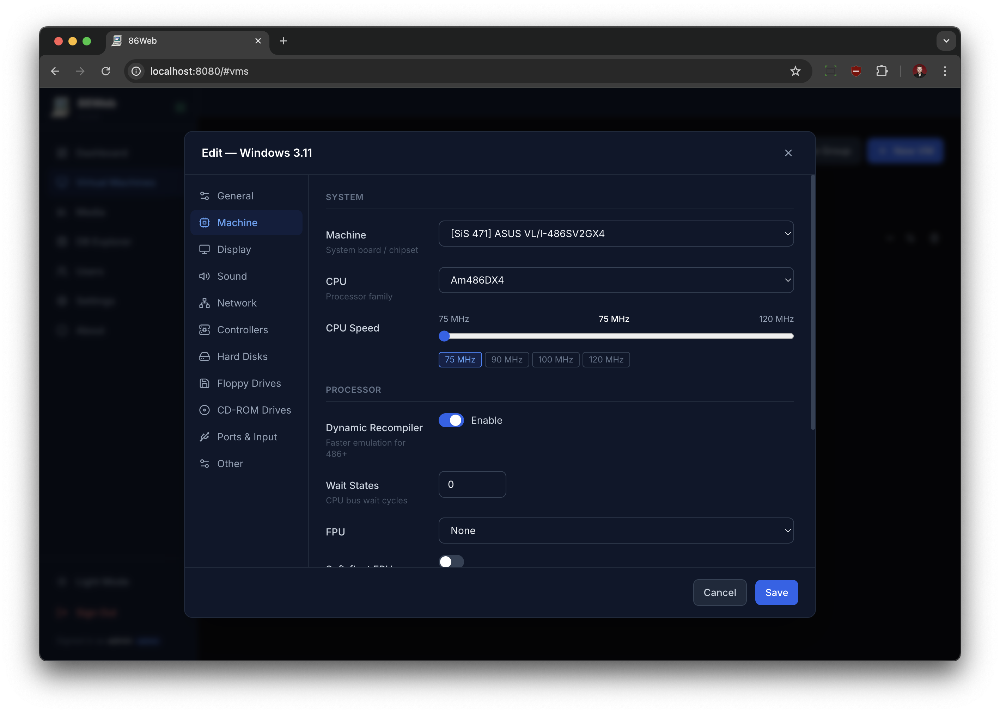
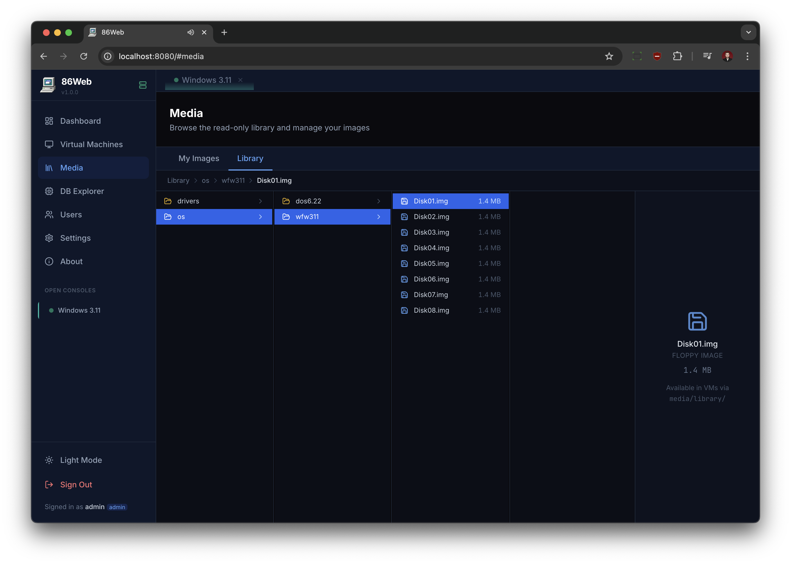
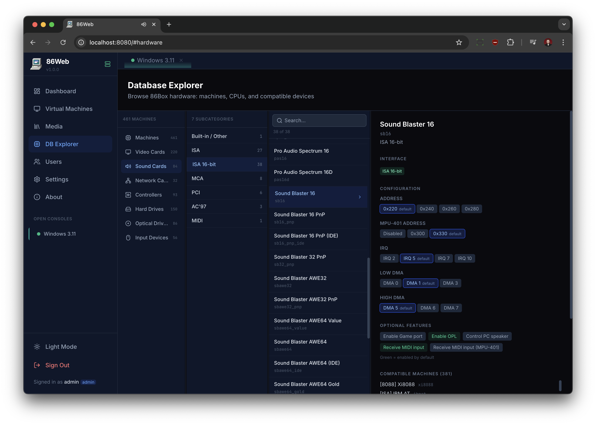

# Sphere86

**Sphere86** is a web-based management interface for [86Box](https://86box.net) PC emulation — inspired by VMware ESXi — that lets you create, configure, start/stop, and interact with vintage PC virtual machines directly in your browser.

---

## TL;DR — Quick Start

```bash
git clone <repo> Sphere86 && cd Sphere86
sudo useradd -r -g Sphere86 -s /usr/sbin/nologin Sphere86  # create service user (groupadd -r Sphere86 first)
cp .env.example .env          # set PUID/PGID to match Sphere86 user, set ADMIN_PASSWORD
sudo bash scripts/init-data.sh  # create data directories with correct ownership
docker compose up -d          # build and start
```

Open `http://localhost` — log in as `admin` / `changeme` (or whatever you set).

> **Minimum requirements:** Docker + Compose v2, Linux host (amd64 or arm64), kernel with bridge/TAP support.

---

## Features

- **Full VM Management** — Create, configure, start, stop, reset, and delete virtual machines running any operating system that 86Box supports (DOS, Windows 3.x–XP, OS/2, Linux, etc.)
- **Complete 86Box Configuration** — Machine type, CPU, memory, video, sound, network, storage controllers, drives, ports, and per-device IRQ/DMA settings — all from the browser
- **Browser VNC Console** — Live display via noVNC over WebSocket with a tabbed multi-VM view; interact with VMs in real time without any client software
- **Browser Audio** — Real-time audio streaming from each VM to your browser via WebM/Opus — hear Sound Blaster, Adlib, and GUS output with no plugins or extra software required; configurable buffer for latency vs. smoothness trade-off
- **VM Groups** — Organise VMs into colour-coded groups for easy management
- **Automatic Group Networking** — Enable networking on a group and every VM in it is automatically connected to a shared private LAN via Linux bridge + TAP devices; VMs can communicate at Layer 2 with zero manual network configuration — just start them and they're connected. No internet access by design; ideal for retro LAN gaming, file sharing, or multi-machine setups
- **Dashboard** — Real-time CPU, memory, disk stats; per-user and system-wide VM counts
- **Multi-user Auth** — Local accounts + LDAP, admin/user roles, per-user VM and storage quotas
- **Media Library** — Column-view browser for your disk images (upload, delete, rename, move); read-only shared library mount for a central image collection
- **Auto-update** — Downloads the latest 86Box binary and ROM files on startup; manual trigger from Settings
- **VM Auto-Shutdown** — Optionally stop VMs that have been running longer than a configurable time limit (env var `VM_AUTO_SHUTDOWN_MINUTES`) — useful for shared installs
- **SSL/TLS Support** — Optional HTTPS with automatic HTTP-to-HTTPS redirect; bring your own certificates (e.g. Let's Encrypt)
- **macvlan Support** — Give Sphere86 its own IP on your LAN; no port forwarding needed
- **Dark & Light Mode**
- **Fully Dockerised** — `docker compose up` and you're running

---

## Screenshots

### Virtual Machines

The main VM management view. VMs are displayed as cards showing machine type, CPU, RAM, and current status. VMs can be organised into colour-coded groups with shared networking — the "Networked Group" above connects its members on a private LAN automatically. Start, stop, edit, or delete any VM with one click.

### VM Console

A live Windows for Workgroups 3.11 session running inside the browser via noVNC. The toolbar provides media mounting, Ctrl+Alt+Del, pause, reset, and power-off controls. Multiple VMs can be open simultaneously in separate tabs, and real-time audio streams directly to the browser.

### VM Configuration

The VM editor gives full access to 86Box's hardware settings — machine/chipset, CPU family and speed, memory, display, sound, network, storage controllers, drives, and ports — all from a categorised sidebar without touching config files.

### Media Library

A column-view file browser for managing disk images. The "My Images" tab holds per-user uploads; the "Library" tab provides a read-only shared collection (floppy images, driver disks, OS installers) available to all users. Select any image to see its type and size, then mount it to a VM.

### Database Explorer

Browse the full 86Box hardware compatibility database. Navigate by category (machines, video cards, sound cards, network cards, controllers, drives) and bus type, then inspect any device's configuration options — IRQ, DMA, I/O addresses, and optional features — along with the list of compatible machines.

---

## Quick Start (Detailed)

### Prerequisites

- Docker Engine 24+ and Docker Compose v2
- Linux host (amd64 or arm64)
- For group networking: `bridge` and `tun` kernel modules loaded on the host

### 1. Clone the repository

```bash
git clone <repo> /srv/Sphere86
cd /srv/Sphere86
```

### 2. Create a service user

Create a dedicated system user and group for Sphere86. All container processes run as this UID/GID.

```bash
sudo groupadd -r Sphere86
sudo useradd -r -g Sphere86 -s /usr/sbin/nologin -d /srv/Sphere86 Sphere86
```

Note the UID and GID for the next step:

```bash
id Sphere86    # e.g. uid=990(Sphere86) gid=990(Sphere86)
```

### 3. Configure `.env`

```bash
cp .env.example .env
$EDITOR .env
```

Set `PUID` and `PGID` to match the user you just created (e.g. `PUID=990`, `PGID=990`). At minimum also set `ADMIN_PASSWORD` and `APP_SECRET_KEY`. See the [Environment Variables](#environment-variables) section for the full reference.

### 4. Initialise the data directory

```bash
sudo bash scripts/init-data.sh
```

This creates the required subdirectory tree under `DATA_PATH` and sets ownership to `PUID:PGID`. If you're using a shared library, ensure it's also readable:

```bash
sudo chown -R $(id -u Sphere86):$(id -g Sphere86) ${DATA_PATH:-./data}
sudo chmod -R u+rwX ${DATA_PATH:-./data}
```

### 5. Start

```bash
docker compose up -d
docker compose logs -f   # watch startup / 86Box download progress
```

Open `http://<host>` in a browser. Default credentials: `admin` / `changeme`.

---

## Environment Variables

All variables are set in `.env` and passed through `docker-compose.yml`. Defaults are shown.

### Core

| Variable | Default | Description |
|---|---|---|
| `PUID` | `1000` | UID that all container processes run as. Should match your host user. |
| `PGID` | `1000` | GID that all container processes run as. |
| `DATA_PATH` | `./data` | Host path for all persistent data (VMs, ROMs, database, cache). |
| `LIBRARY_PATH` | `./library` | Host path for the read-only shared disk-image library. Leave unset or point to an empty dir if not using. |
| `WEB_PORT` | `80` | Host port the nginx frontend listens on. |
| `LOG_LEVEL` | `info` | Log verbosity for backend and runner. One of: `debug`, `info`, `warning`, `error`. |

### SSL / TLS

| Variable | Default | Description |
|---|---|---|
| `HTTPS_PORT` | `443` | Host port for HTTPS. Only used when `SSL_CERTS_DIR` is set. Uncomment the HTTPS port mapping in `docker-compose.yml` to enable. |
| `SERVER_NAME` | `_` (any) | Hostname nginx will answer on (`server_name` directive). Leave unset to accept any hostname. |
| `SSL_CERTS_DIR` | *(empty)* | Host directory containing `fullchain.pem` and `privkey.pem`. When set and both files exist, nginx serves HTTPS and redirects HTTP to HTTPS. Leave unset to serve plain HTTP only. |

### Authentication & Users

| Variable | Default | Description |
|---|---|---|
| `USER_MANAGEMENT` | `true` | Set to `false` to disable all authentication. The UI becomes fully open — no login required. **Disables LDAP, per-user quotas, and the user admin panel.** |
| `APP_SECRET_KEY` | *(random)* | Secret used to sign JWT tokens. If not set, a random key is generated at startup — all sessions are invalidated when the container restarts. Set this to a stable secret in production. |
| `ADMIN_USERNAME` | `admin` | Username for the bootstrap admin account created on first run. Has no effect after the first boot. |
| `ADMIN_PASSWORD` | `changeme` | Password for the bootstrap admin account. **Change this.** Has no effect after the first boot. |
| `ADMIN_EMAIL` | `admin@example.com` | Email for the bootstrap admin account. Has no effect after the first boot. |
| `JWT_ALGORITHM` | `HS256` | JWT signing algorithm. Only change if you know what you're doing. |
| `ACCESS_TOKEN_EXPIRE_MINUTES` | `1440` | How long login sessions last (default: 24 hours). |

> **Note on `USER_MANAGEMENT=false`:** When disabled, the login page is bypassed entirely. All VMs from all users are visible. LDAP settings are ignored. The `ADMIN_*` variables still seed the database but the account is unused.

### LDAP

LDAP is only active when **both** `USER_MANAGEMENT=true` **and** `LDAP_ENABLED=true`.

| Variable | Default | Description |
|---|---|---|
| `LDAP_ENABLED` | `false` | Enable LDAP authentication alongside (or instead of) local accounts. |
| `LDAP_SERVER` | *(empty)* | LDAP server URI, e.g. `ldap://ldap.corp.example.com`. |
| `LDAP_PORT` | `389` | LDAP port. Use `636` for LDAPS. |
| `LDAP_BASE_DN` | *(empty)* | Base DN for user searches, e.g. `dc=corp,dc=example,dc=com`. |
| `LDAP_BIND_DN` | *(empty)* | DN used to bind for directory searches (read-only service account), e.g. `cn=readonly,dc=corp,dc=example,dc=com`. |
| `LDAP_BIND_PASSWORD` | *(empty)* | Password for `LDAP_BIND_DN`. |
| `LDAP_USER_FILTER` | `(objectClass=person)` | LDAP filter applied when searching for a user by username. |
| `LDAP_GROUP_DN` | *(empty)* | DN of the group whose members are allowed to log in, e.g. `cn=Sphere86-users,ou=groups,dc=corp,dc=example,dc=com`. Leave empty to allow all LDAP users. |
| `LDAP_USERNAME_ATTR` | `uid` | LDAP attribute that contains the username (Active Directory: `sAMAccountName`). |
| `LDAP_EMAIL_ATTR` | `mail` | LDAP attribute that contains the user's email address. |
| `LDAP_TLS` | `false` | Enable StartTLS on the LDAP connection. |

LDAP users are auto-provisioned in the local database on first login if they are a member of `LDAP_GROUP_DN`. They receive the default quota (`DEFAULT_MAX_VMS`, `DEFAULT_MAX_STORAGE_GB`) and are created as regular users. An admin can grant admin rights to any LDAP user from the User Management panel after provisioning.

### User Quotas

Quotas only apply when `USER_MANAGEMENT=true`. Admins are not subject to quotas.

| Variable | Default | Description |
|---|---|---|
| `DEFAULT_MAX_VMS` | `10` | Maximum number of VMs a new user may create. |
| `DEFAULT_MAX_STORAGE_GB` | `100` | Maximum total disk image storage (GB) a new user may use. |

### 86Box / Runner

| Variable | Default | Description |
|---|---|---|
| `BOX86_VERSION` | *(empty)* | Pin a specific 86Box release tag, e.g. `v4.0`. Leave empty to always use the latest stable release. |
| `BOX86_ARCH` | `x86_64` | CPU architecture for the 86Box binary. Use `aarch64` for ARM hosts. |
| `BASE_VNC_PORT` | `5900` | First VNC port allocated to VMs (internal to the runner container; not exposed to the host). |
| `BASE_WS_PORT` | `6900` | First WebSocket port allocated to VMs (internal to the runner container). |
| `MAX_CONCURRENT_VMS` | `50` | Maximum number of VMs that can be registered/tracked simultaneously. |
| `ACTIVE_VM_LIMIT` | `5` | Hard cap on simultaneously running VMs. 86Box is CPU-intensive; set this to a value your host can sustain. Use `GET /api/system/recommended-vm-limit` (admin) for a host-tuned suggestion. |
| `VM_AUTO_SHUTDOWN_MINUTES` | `0` | Automatically stop VMs that have been running longer than this many minutes. `0` disables auto-shutdown. Useful for shared installs where users may forget to stop VMs (e.g. `1440` = 24 hours). |
| `AUDIO_BUFFER_SECS` | `0.4` | Audio buffer duration in seconds passed to the frontend. Increase to reduce audio glitches on slow connections; decrease for lower latency. |
| `RUNNER_URL` | `http://runner:8001` | Backend-to-runner URL. Only change if running runner outside Docker. |

---

## Architecture

Sphere86 is three Docker containers communicating over a private bridge network. Only the `web` container is exposed to the outside.

```
Browser
  │  HTTP / WebSocket
  ▼
┌─────────────────────────────┐
│  web (nginx)                │  port 80 (or WEB_PORT)
│  ─ serves React SPA         │
│  ─ /api/*  → backend:8000   │
│  ─ /vnc/*  → runner:8001    │
│  ─ /vms/*/audio → runner    │
└────────────┬────────────────┘
             │ Docker private network
    ┌────────┴─────────┐
    │                  │
    ▼                  ▼
┌──────────┐    ┌──────────────────────────────────────────┐
│ backend  │    │ runner                                   │
│ :8000    │◄──►│ :8001                                    │
│          │    │                                          │
│ FastAPI  │    │ FastAPI + process supervisor             │
│ SQLite   │    │ Per-VM: Xvnc + matchbox-wm + 86Box      │
│ Auth/JWT │    │         PulseAudio + ffmpeg audio        │
│ REST API │    │ Group networking: Linux bridge + TAP     │
└──────────┘    └──────────────────────────────────────────┘
```

### Container: `web` (nginx)

- Serves the pre-built React/Vite single-page application from `/usr/share/nginx/html`
- Reverse-proxies all `/api/` requests to `backend:8000`
- Proxies VNC WebSocket connections (`/vnc/{vm_id}/websockify`) to `runner:8001`, which forwards them to the correct per-VM Xvnc port
- Proxies audio streams (`/vms/{vm_id}/audio`) to `runner:8001`, where ffmpeg encodes PulseAudio output as WebM/Opus
- Allows uploads up to 8 GB (`client_max_body_size`)

### Container: `backend` (FastAPI)

- REST API for all frontend operations (auth, VM CRUD, groups, users, media, system stats)
- SQLite database at `$DATA_PATH/config/Sphere86.db` — stores users, VMs, groups, settings
- JWT-based authentication with optional LDAP integration
- Generates `86box.cfg` files from VM configuration stored as JSON in the database
- Delegates VM lifecycle operations (start/stop/reset) to the runner via HTTP
- Hardware list derived from a bundled `86box_hardware_db.json` (generated from 86Box source at build time)

### Container: `runner` (FastAPI + process manager)

- Manages VM processes: one supervisor entry per running VM
- Per-VM process stack:
  1. **PulseAudio** — isolated daemon per VM (`/tmp/pulse-vm{slot}`)
  2. **Xvnc** — virtual framebuffer + built-in VNC server, no physical display needed
  3. **matchbox-window-manager** — minimal WM so 86Box windows behave correctly
  4. **86Box** — the actual emulator, connected to Xvnc display and PulseAudio
- **Audio**: ffmpeg captures the PulseAudio monitor source and streams WebM/Opus on request
- **Group networking**: creates `br-group-{id}` Linux bridges and `tap-vm{id}` TAP devices; bridge persists while any group VM is running, torn down when the last stops
- Downloads 86Box binary and ROM pack from GitHub Releases on startup; respects `BOX86_VERSION` pin
- Runs as `PUID:PGID`; uses a scoped `sudo /sbin/ip` rule for bridge/TAP creation

### Data flow: starting a VM

1. Frontend `POST /api/vms/{id}/start` → nginx → backend
2. Backend reads VM config from DB, writes `86box.cfg` to disk (applying any group-network overrides)
3. Backend calls runner `POST /runner/vms/{id}/start` with VM metadata
4. Runner sets up TAP/bridge (if group networking), spawns PulseAudio + Xvnc + matchbox + 86Box
5. Backend returns `{ vnc_port, ws_port }` to frontend
6. Frontend opens noVNC WebSocket to `/vnc/{vm_id}/websockify` → nginx → runner → Xvnc

### Group Networking

When a VM group has **Network** enabled:

- A Linux bridge `br-group-{group_id}` is created (if not already up) when the first VM in the group starts
- Each VM gets a TAP device `tap-vm{vm_id}` attached to the bridge
- 86Box is configured to use `net_type=pcap` with `net_host_dev=tap-vm{vm_id}` at start time (not persisted to the DB — the UI setting remains `slirp` or whatever the user configured)
- The bridge is isolated — no routing to the host or internet; VMs communicate at Layer 2 only
- DHCP is **not** provided automatically — assign static IPs inside the VMs, or run a DHCP server on one of them
- The TAP is torn down when the VM stops; the bridge is torn down when the last VM in the group stops
- Requires `NET_ADMIN` capability and `/dev/net/tun` on the runner container (already configured in `docker-compose.yml`)

---

## Volume Mounts

All persistent data lives under a single `DATA_PATH` directory on the host:

```
DATA_PATH/
├── vms/
│   └── {vm_id}/{uuid}/
│       ├── 86box.cfg          ← generated 86Box config (rewritten on each start)
│       ├── hdd/               ← virtual hard disk images (.img)
│       └── media/             ← per-VM ISO/floppy images
│           └── library/       ← symlink/mount point for shared library
├── roms/                      ← 86Box ROM files (auto-downloaded)
├── config/
│   └── Sphere86.db               ← SQLite database
├── cache/
│   └── 86box/
│       └── 86Box              ← downloaded 86Box binary
└── user_images/               ← user-uploaded disk images (per-user subdirs when USER_MANAGEMENT=true)
    └── {user_id}/
```

`LIBRARY_PATH` is mounted read-only at `/library` inside both backend and runner. It is exposed to VMs through nginx as a static file tree browsable in the Media page.

---

## macvlan (Static LAN IP)

To give Sphere86 its own IP address on your LAN (no port forwarding, appears as a physical host):

```bash
# Create the macvlan network once (adjust subnet/gateway/parent to match your LAN)
docker network create \
  -d macvlan \
  --subnet=192.168.46.0/24 \
  --gateway=192.168.46.1 \
  -o parent=eth0 \
  netpub

# Start with the macvlan overlay
docker compose -f docker-compose.yml -f docker-compose.macvlan.yml up -d
```

Edit `docker-compose.macvlan.yml` to change the static IP from `192.168.46.101`. The `web` container's host port mapping is removed; the macvlan interface provides the IP directly.

---

## Hardware Database CLI

A standalone CLI tool is included for exploring the 86Box hardware compatibility database — useful for checking which cards work with a given machine type without starting the UI.

```bash
# Run interactively (auto-finds the database)
python3 scripts/query_86box.py

# List all machine internal names
python3 scripts/query_86box.py --list-machines

# Non-interactive: show all compatible video cards for a specific machine
python3 scripts/query_86box.py --machine ibmpc --category video_cards

# Available categories:
#   video_cards, sound_cards, network_cards, hdc, scsi,
#   fdc, cdrom_interface, cdrom_drive_types, isartc, isamem

# Override the database path
python3 scripts/query_86box.py --db /path/to/86box_hardware_db.json
```

**Interactive mode** lets you:
- Browse machines by type, search by name, or enter an internal name directly
- View machine details (bus flags, CPU packages, RAM range, built-in devices)
- Browse all compatible hardware for each category, with bus type annotations
- See per-device configuration options (IRQ, DMA, I/O base, etc.)
- Run a full compatibility summary across all hardware categories

The database is generated from 86Box source at build time and lives at `/data/cache/86box_hardware_db.json` inside the backend container (or `backend/app/86box_hardware_db.json` in the repo).

---

## LDAP Configuration Example

```env
LDAP_ENABLED=true
LDAP_SERVER=ldap://ldap.corp.example.com
LDAP_PORT=389
LDAP_BASE_DN=dc=corp,dc=example,dc=com
LDAP_BIND_DN=cn=readonly,dc=corp,dc=example,dc=com
LDAP_BIND_PASSWORD=secret
LDAP_GROUP_DN=cn=Sphere86-users,ou=groups,dc=corp,dc=example,dc=com
LDAP_USERNAME_ATTR=uid
LDAP_EMAIL_ATTR=mail
LDAP_TLS=false
```

For Active Directory, set `LDAP_USERNAME_ATTR=sAMAccountName`.

---

## Development

```bash
# Frontend (Vite dev server on :5173)
cd frontend && npm install && npm run dev

# Backend (FastAPI with auto-reload on :8000)
cd backend && pip install -r requirements.txt
uvicorn app.main:app --reload --port 8000

# Runner (FastAPI with auto-reload on :8001)
cd runner && pip install -r requirements.txt
uvicorn app.main:app --reload --port 8001
```

The frontend dev server proxies `/api/`, `/vnc/`, and `/vms/*/audio` to the local backend/runner — see `frontend/vite.config.ts`.

---

## Credits

- [86Box](https://86box.net) — the emulator
- [noVNC](https://novnc.com) — browser VNC client
- [PulseAudio](https://www.freedesktop.org/wiki/Software/PulseAudio/) + [ffmpeg](https://ffmpeg.org) — audio pipeline
- [Xvnc](https://tigervnc.org) — virtual framebuffer + VNC server
